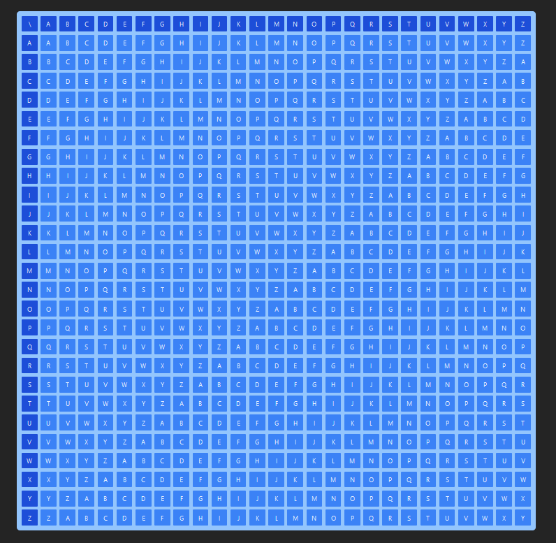
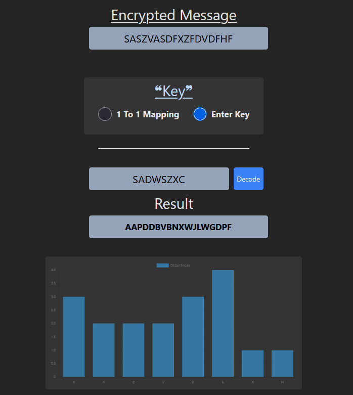
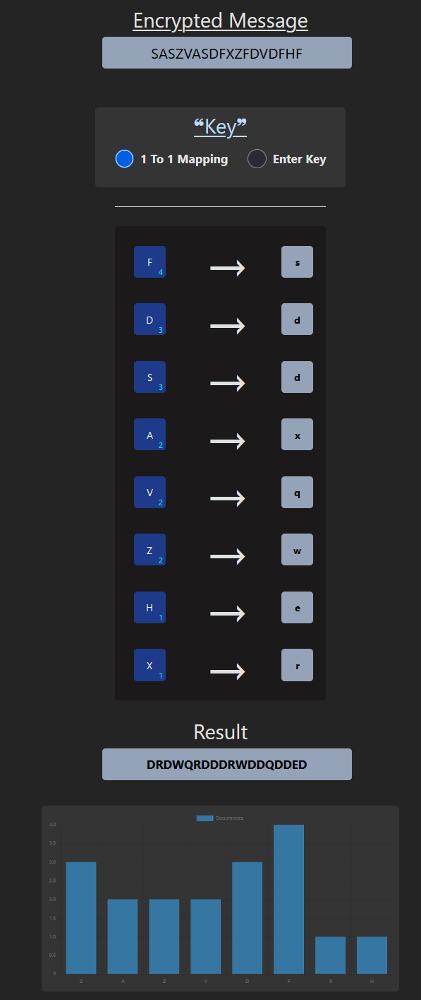

# Vigenère Cipher Cracker 🔓

A React-based web application for decrypting messages encoded with the Vigenère cipher. The currently tool offers two decryption methods: direct key input, and Letter 1 to 1 Mapping, with letter frequency analysis and more to come in the future. 
This project was an experiment made in **less than a day**, more on that in the following sections

## Features ✨

- Interactive Vigenère table visualization
- Two decryption modes:
  - Direct key entry for known keys
  - Letter frequency analysis with 1-to-1 letter mapping
- Real-time letter frequency chart
- Character frequency visualization using Chart.js
- Sleek design with Tailwind CSS

## Why did I Make this ? 🤔

Good question, got carried away solving a CTF, and decied to **make my own decryption tool** for the famous encryption method of Vigenère Cipher

## Beta Version Interface : 📸





## ⚠️ Project Status: Early Beta

> **Warning**: This project is in early development stages. Features may be incomplete or subject to change. Bugs and instability should be expected. Not recommended for production use yet.


## Installation 🛠️

1. Clone the repository
2. Install dependencies:
```sh
npm install
```

3. Start the development server:
```sh
npm run dev
```

## Usage 🌻

1. Enter your encrypted message in the "Encrypted Message" field
2. Choose your decryption method:
   - "Enter Key" - Input a known Vigenère key
   - "1 To 1 Mapping" - Use frequency analysis to manually map letters
3. The decrypted result will appear in the "Result" field
4. View letter frequencies in the chart below

## Technologies Used ⚙️

- React
- Tailwind CSS
- Chart.js
- Framer Motion
- Vite

## Scripts 📜

- `npm run dev` - Start development server
- `npm run build` - Build for production
- `npm run preview` - Preview production build

## License ⚖️

[](https://opensource.org/licenses/MIT)

This project is licensed under the MIT License - see the [LICENSE](LICENSE) file for details.

Permission is hereby granted, free of charge, to any person obtaining a copy of this software and associated documentation files (the "Software"), to deal in the Software without restriction, including without limitation the rights to use, copy, modify, merge, publish, distribute, sublicense, and/or sell copies of the Software.